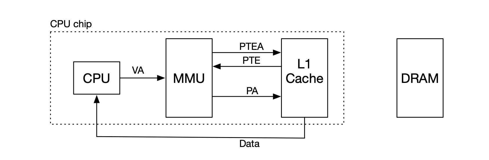

##  Program Optimization

### Motivations to Optimizations
- The limitation for the optimizing compilers are:
	- The program behavior cannot be changed, especially under pathological conditions.
	- Extensive procedure or optimization among different files are hard.
	- The compiler must be conservative when in doubt.

### Strategies for Optimization
- **Code Motion** reduces the computation performed if they have the same result, especially in a loop.

```c
// Before Optimization:
for (int j = 0; j < n; j++) a[n * i + j] = b[j];

// After Optimization:
int ni = n * i;
for (int j = 0; j < n; j++) a[ni + j] = b[j];
```
- **Replacing costly operation** uses add and shift instead of multiply or divide:
	- E.g.: Make `16 * x` into `x << 4`.
	- E.g.: One can inspect the loop structure to make integral multiplication into adding by a constant being added multiple times.
	- One can also share the common subexpressions, such as index calculation, `inj = i * n + j;`.
- **Reduce procedure calls** omits function calls in loops when the value is unchanged:
	- Specifically, there are obvious function calls like accessors, but also some hidden calls, like boundary checks, in which we can avoid.

```c
// Before Optimization:
for (size_t i = 0; i < strlen(s); i++) /* manupulations on s */;

// After Optimization:
size_t len = strlen(s);
for (size_t i = 0; i < len; i++) /* manupulations on s */;
```
- Prevent memory aliasing and introducing local variables (same element of array to local variable):
	- Using aliasing would make the compiler to check for aliasing, as it is easy to happen.
	- One can create a local variable to and store once to prevent compiler repetitively accessing a single pointer.
- Use **Instruction-Level Parallelism**, which is having multiple operations at the same time.
	- The *cycle per element* (CPE) is a convenient way to express performance of program that operates on *vectors or lists*, with parameters:
		- Length = $$n$$,
		- CPE = $$\text{cycles per OP}$$:

		$$
		T = n\times \operatorname{CPE} + \operatorname{Overhead}.
		$$

### Superscalar Processor
- A superscalar processor can issue and execute *multiple instructions in one cycle*. The instructions are retrieved from a sequential instruction stream and are usually scheduled dynamically:
	- The superscalar processor allows working without programming effort and take advantage of the instruction level parallelism that most programs have.
- In executing the following code, although each multiplication takes 3 stages, they can be executed optimally with superscalar processor:

```c
long mul_eg(long a, long b, long c) {
	long p1 = a * b;
	long p2 = a * c;
	long p3 = p1 * p2;
	return p3;
}
```
- In executing the above function, the multiplications can be arranged into the below three blocks: 


| &nbsp;  | 1     | 2     | 3     | 4     | 5       | 6       | 7       |
| ------- | :---: | :---: | :---: | :---: | :-----: | :-----: | :-----: |
| Stage 1 | `a*b` | `a*c` |       |       | `p1*p2` |         |         |
| Stage 2 |       | `a*b` | `a*c` |       |         | `p1*p2` |         |
| Stage 3 |       |       | `a*b` | `a*c` |         |         | `p1*p2` |

- For Haswell CPU, there are 8 total functional units, with multiple instructions can be executed in parallel:
	- 2 load, with address computation,
	- 1 store, with address computation,
	- 4 integer,
	- 2 FP multiply,
	- 1 FP add,
	- 1 FP divide.
- Although some instructions take more than 1 cycle, they can be pipelined:

| Instruction                 | Latency | Cycles/Issue |
| --------------------------- | :-----: | :----------: |
| Load / Store                |    4    |      1       |
| Integer Multiply            |    3    |      1       |
| Integer / Long Divide       |  3-30   |     3-30     |
| Single / Double FP Multiply |    5    |      1       |
| Single / Double FP Add      |    3    |      1       |
| Single / Double FP Divide   |  3-15   |     3-15     |

### Optimization for Processor
- The **latency bound** gives a minimum value for the CPE for any function that must perform the combining operation in a strict sequence. (How many steps it takes to do.)
- The **throughput bound** gives a minimum bound for the CPE based on the maximum rate at which the functional units can produce results. (How much the CPU functionalities are saturated.)
- The bounds for the operations are as follows, in general, they define the lower bound of the best operation:


| &nbsp;     | Integer | Integer | Floating Point | Floating Point |
| ---------- | :-----: | :-----: | :------------: | :------------: |
| Bound      |   `+`   |   `*`   | `+`            | `*`            |
| Latency    |  1.00   |  3.00   | 3.00           | 5.00           |
| Throughput |  0.50   |  1.00   | 1.00           | 0.50           |

- **Loop Unrolling**, the unrolling means to make loop increment by 2 instead of 1 so it performs double of useful work per iteration.
- The re-association of `x = x OP a OP b` to `x = x OP (a OP b)` would allow better efficiency as there will be more parallelism (as there are less dependency):
	- Even further, for addition, we can have `x1 = x1 OP a`, `x2 = x2 OP b` in each iteration and eventually allow `x = x1 + x2` to construct two *streams* of operations.
- In particular, the unroll factor ($$L$$) means how many operations must be made in an iteration and the accumulator ($$K$$) indicates how many results are in parallel, their relationship is $$K \mid L$$.
- For double FP, the best operation would have a certain unrolling factor and the accumulators.

### AVX2
- AVX2 ensembles the **YMM register**, which has 16 registers in total, each with 32 bytes, this can be:
	- 32 single-byte integers,
	- 13 16-bit integers,
	- 8 32-bit integers,
	- 8 single-precision floats, or
	- 4 double-precision float.
- The **SIMD** operations are on these vectors, which is:
	- e.g.: `vaddsd %ymm0, %ymm1, %ymm1` adds each entry of `%ymm0` with `%ymm1` into `%ymm1`, which incurs a lower vector throughput bound.

## CPU Structures

### MIPS Structure
- Developed in an early stage, MIPS is the motivation for modern CPUs.
- The MIPS structure embodies some features, like:
	- 32 bit architecture for registers and memory addresses.
	- Uses 32 registers in total.
	- Has multiply and division instructions and floating point numbers.
- The manipulations are based on the register:
	- e.g. to express `a = b + c`, that is `add a, b, c`, where `a`, `b`, and `c` are registers.
	- Registers has specialized usages and conventions:

|   Entry    |  Register   | Specialized Usage / Convention                              |
| :--------: | :---------: | :---------------------------------------------------------- |
|     0      |   `$zero`   | always has the value $$0$$.                                   |
|     1      |    `$at`    | conventionally reserved for pseudo-instructions             |
|    2-3     | `$v0`-`$v1` | conventionally return values of a function call             |
|    4-7     | `$a0`-`$a3` | conventionally arguments for a function call                |
| 8-15,24,25 | `$t0`-`$t9` | conventionally temporaries, can be overwritten by functions |
|   16-23    | `$s0`-`$s7` | conventionally saved, have to be preserved by functions     |
|   26-27    | `$k0`-`$k1` | conventionally reserved for kernel                          |
|     28     |    `$gp`    | conventionally global area pointer                          |
|     29     |    `$sp`    | conventionally stack pointer                                |
|     30     |    `$fp`    | conventionally frame pointer                                |
|     31     |    `$ra`    | always contains the return address                          |

### MIPS Pipelines
- The MIPS Structure separates the procedures into pipelines:
	- The pipeline has the theoretical speed-up, but *the actual speed-up* may not be fully reached.
	- The more tasks makes the speed-up approaches the theoretical limit.
- The MIPS Pipelines have the following procedures:
	1. Instruction Fetch: Fetch instruction from memory, takes $$200\mathrm{ps}$$.
	2. Register Read: Read registers and decode instructions (*registers are always encoded in same place in instruction*), takes $$100\mathrm{ps}$$.
	3. ALU: Execute operation or calculate an address, takes $$200\mathrm{ps}$$.
	4. Data Access: Access an operand in memory, takes $$200\mathrm{ps}$$.
	5. Register Write: Write results into a register, takes $$100\mathrm{ps}$$.
	-  **Load word** (lw) takes all procedures, so total time is $$800\mathrm{ps}$$.
	-  **Store word** (sw) takes all procedures but register write, so total time is $$700\mathrm{ps}$$.
	-  **R-format** (add) takes all procedures but data access, so total time is $$600\mathrm{ps}$$.
	- **Brand** (beq) takes instruction fetch, register read, and ALU, so total time is $$500\mathrm{ps}$$.
- The pipeline allows the theoretical speed-up of 4 times:
	- In the pipeline, even if a task takes half of time cycle, it still needs to align with the full time cycle block.
	- The more tasks there are, the speed-up approaches closer to the theoretical limit.
	- There are cases of **Hazards**, in which the next instruction cannot be executed in the next clock cycle.
- In each stage of the pipeline, the information from instruction is needed:
	- on which ALY operation to execute, which memory address to consult, and which register to write to.
	- the control information has to be passed through stages:
	

### MIPS Hazards
- *Hazards* happens when the next instruction cannot be executed in next clock cycles, with three types.
- **Structural hazard** happens when *instructions overlap in resource use in the same stage*:
	- MIPS is designed to avoid structural hazards, *i.e.*, it will delay certain operations.
	- An example would be when the same instruction (memory access) is called at stage 4:

|     | 1     | 2      | 3      | 4      | 5      | 6        | 7        |
| --- | ----- | ------ | ------ | ------ | ------ | -------- | -------- |
| i1  | FETCH | DECODE | MEMORY | MEMORY | ALU    | REGISTER |          |
| i2  |       | FETCH  | DECODE | MEMORY | MEMORY | ALU      | REGISTER |

- **Data hazard** happens when *instruction waits on result from prior instruction*:
	- In terms of data hazard, the CPU adds wiring to the circuit to directly connect output of the ALU for the next instruction to the delay do not need to wait:
		- In particular, the *execution* of the previous step can be pushed to the *execution* of the next step, no need to wait for write back to instruction decode.
	- For instance, there are memory access conflicts at the following example of data dependence (sometimes, a reorder would work):
```
add $s0, $t0, $t1
sub $t0, $s0, $t3    // Here, $s0 will be write by the previous step.
```
- **Control hazard** happens when *selection of next instruction depends on outcome of previous*:
	- In terms of a control hazard, the following instructions cannot start until branch condition result is known.
	- The **branch hazard** would be at full speed when assuming the branches are never taken:
		- In particular, we can keep record of branch taken or not and make prediction based on the history.
	- An example would be having a comparison before prior steps:
```
add $s0, $t0, $t1
beq $s0, $s1, ff40  // The comparison involves data hazard from add
                    // Jump to address ff40 if they are equal
sub $t0, $s0, $t3   // Executes only if previous has non-zero-flag
```
- The control or branch hazard is has instruction control unit that work well ahead of execution unit to generate enough operations to keep the EU busy:
	- At the conditions, when it cannot be determined, the execution would begin the next one as prediction, but it do not actually modify register or memory data for the predicted position.


## Memory Hierarchy

### Locality
- The expectation is to have lots of memory and quick access, but the speed and size for memories have tradeoffs.
- A helpful concept is *locality*, which is the trend to reference data items that are near other recently referenced data items or that were recently referenced themselves:
	- **Temporal locality** accounts for the same memory location that are often referenced repeatedly:
		- e.g.: The using of the instructions in loops.
	- **Spatial locality** accounts for which is after an item being referenced:
		- e.g.: The processing of a sequential data.
- In particular, an example is to access the elements in a 2-D array, when having loops, looping though horizontal would be fast:

```c
for (int i = 0; i < size; i++) {
	for (int j = 0; j < size; j++) {
		matrix[i][j] = 1;  // This is much faster than matrix[j][i] = 1;
	}
}
```

### Types of Memories
- From the fastest speed / smallest capacity to the slowest speed / biggest capacity (and highest cost to lowest cost), we have:
	- SRAM on CPU $$\Rightarrow$$ DRAM on motherboard $$\Rightarrow$$ Flash memory $$\Rightarrow$$ Magnetic disk.
	- The SRAM is integrated in CPU, runs at similar clock speeds, and uses more transistors with flip flops.
	- The DRAM is on separated chips, or multiple chips on module (DIMM), with capacitors, so they lose charge frequently and when power is turned off.
	- Flash memory is EEPROM (electrically erasable programmable read-only memory), which allows reading multiple bytes and write require erase of a block (so write can ear out the memory).
	- Hard drives are magnetic charge on spinning disk, and the read/write requires head at the right place. The access is slow but it store bulk of data storage.
- Typically, the 2 Level Memory involves the follows:

$$
\text{Processor} \longleftrightarrow \text{Cache} \longleftrightarrow \text{Main Memory (DRAM)}.
$$

- Here, the memory is requested from CPU, if data is found in cache, it is sent directly to CPU, which is a **cache hit**.
	- If data is not found in cache, the memory is requested from cache to main memory (which is slow) and then sending data from memory to cache, storing it, and eventually send to processor. This is a **cache miss**.
- The memory embodies the following concepts:
	- **Cache** is the small memory connected to processor.
	- **Block** is the unit of memory that is transferred.
	- **Hit rate** is the fraction of memory lookups served by data already in cache.
	- **Miss rate** is the fraction of memory lookups requiring memory transfers.
	- **Hit time** is the time to process a cache hit.
	- **Miss penalty** is the time to process a cache miss, typically $$100\times$$.
- The memory hierarchy allows many levels, where the transfer between memory in level $$i$$ and $$i+1$$ follows the same principle, and moreover, if an item is in level $$i$$, then it appear in level $$i+1$$.




### Caching Strategies
- All data is in large main memory, but data for processing has to moved to cache:
	- The main concern is on the mapping between cache and main memory, with which data to read / keep / write.
	- For each entry, we keep a valid bit to record if the value is recorded or not.
- **Direct mapping** keep mapping from cache to main memory simple, which uses part of the address as index to cache:
	- **memory position in block** (offset) is $$\log_2(\text{block size bits})$$.
	- **index** is $$\log_2(\text{number of slots})$$.
	- **tag to identify position** in main memory is the remaining of address.

	$$
	\underbrace{\boxed{\big|\qquad \text{tag}\qquad}}_{\text{rest of the address}}\underbrace{\boxed{\big|\qquad \text{index}\qquad}}_{{\log_2(\text{number of slots})}}\underbrace{\boxed{\big|\qquad \text{offset}\qquad}}_{\log_2(\text{block size bits})}.
	$$

	- If blocks with same index are used, older one is overwritten.
	- Moreover, the block size incurs tradeoffs:
		- Larger block size implies fewer cache misses, but longer time to transfer and fewer blocks in cache.
		- In practice, we seek an optimal value somewhere in the middle.
- **Fully Associative Cache** does not have index but rather place block anywhere in the cache:
	- **memory position in block** (offset) is $$\log_2(\text{block size bits})$$.
	- There is no **index**.
	- **tag to identify position** in main memory is the remaining of address.

	$$
	\underbrace{\boxed{\big|\qquad\qquad \text{tag}\qquad\qquad}}_{\text{rest of the address}}\underbrace{\boxed{\big|\qquad \text{offset}\qquad}}_{\log_2(\text{block size bits})}.
	$$

	- The fully associative cache eliminates the issue with replacing the old tags, however, finding block in cache is expensive.
- **Set Associative Cache** introduces the intermediate, where we use a part of address to determine a subset of cache, but there are more than one slot for each index part of cache:
	- **memory position in block** (offset) is $$\log_2(\text{block size bits})$$.
	- **index** is $$\log_2(\text{number of slots})$$.
	- **tag to identify position** in main memory is the remaining of address.

	$$
	\underbrace{\boxed{\big|\qquad \text{tag}\qquad}}_{\text{rest of the address}}\underbrace{\boxed{\big|\qquad \text{index}\qquad}}_{{\log_2(\text{number of slots})}}\underbrace{\boxed{\big|\qquad \text{offset}\qquad}}_{\log_2(\text{block size bits})}.
	$$

	- Note that for a $$n$$-way set-associate ($$n$$ has to be an integer power of $$2$$), there will be $$n$$ sets in for each index.
	- The total capacity of the cache (or total amount of data is) has the following relationship:

	$$
	\text{Capacity} = \#\text{Sets} \times \#\text{Block Size}\times\text{Associative Factor}.
	$$

	- For set associative cache, there will be caching strategies, the blocks are read in when needed.
	- When the cache is full, the blocks are discarded based on:
		- Random discard.
		- Number of time accessed.
		- Least recent use (**LRU**) in which the least recent accessed block get discarded first.
		- First in, first our (**FIFO**) in which the oldest block get discarded first.
	- The **LRU** and **FIFO** needs an introduction of timestamp, in which we always find the $$2^n-1$$ timestamp (where $$n$$ is the associative factor) and use the slot for latest access / new memory block with $$0$$, and increment the rest up to the access one / no bound by $$1$$.
	- In terms of write, when we have write-hit, we have the following strategies:
		- **Write-through**: we write the value in that address immediately to the memory.
		- **Write-back**: we defer the write to memory until replacement of line. Here, the block is marked as dirty and it will be written to memory when it is evicted.
	- When we have write-miss, we have the following strategies:
		- **Write-allocate**: we load the value of the address to the cache and update the line in cache, it is good when there are more writes to the location locality.
		- **No-write-allocate**: we write straightly to the memory and load nothing to the cache.
	- Typically, we have *write-through + no-write-allocate* or *write-back + write-allocate*, and *write-back + no-write-allocate* is not allowed.




### Cache Performances
- The Intel Core i7 Cache has 3 level of caches, which respectively:
	- L1 i-cache and d-cache: 32KB, 8-way, with 4 cycles to access;
	- L2 unified cache: 256KB, 8-way, with 10 cycles to access;
	- L3 unified cache: 8MB, 16-way, with 40-75 cycles to access.
	- For all caches, the block size is 64 bytes.
- The cache performance uses the following metrics:
	- **Miss Rate** is the fraction of memory references not found in cache (misses / accesses) = 1 – hit rate.
		- It is typically 3-10% for L1, and can be quite small (e.g., < 1%) for L2, depending on size, etc.
		- The hit and miss differs by $$100\times$$ for just L1 and main memory, so 99% hit is twice as good as 97% hit.
	- **Hit Time** is the time to deliver a line in the cache to the processor, and it includes time to determine whether the line is in the cache.
		- It is typically 4 clock cycle for L1 and 10 clock cycles for L2.
	- **Miss Penalty** is the additional time required because of a miss, which is typically 50-200 cycles for main memory.
		- The trend should be increasing.

### Cache Friendly Code
- In developing the cache friendly code, we shall:
	- make the common case go faster, especially on the inner loops of the core functions.
	- minimize the misses in the inner loops, which is preserving temporal and spatial locality (for repeated references to variables and stride-1 reference patters).
- An example for cache manipulation is on matrix multiplication:
	- Since `C` arrays are allocated in row-major order, each row is contiguous memory location, so the optimal one is `kij` order:

```c
for (k = 0; k < n; k++) {
	for (i = 0; i < n; i++) {
		r = a[i][k];                 // reduce repeated access
		for (j = 0; j < n; j++) {
			v[i][j] += r * b[k][j];
		}
	}
}
```
- The example achieves 0.5 misses per iteration, while the other strategies also exceeds the L2 and L3 cache limits.

## Linking

### Compilation Process and Static Linking
- In conventional compilation, the output file is small since the executions is put into the dynamic library.
- To achieve static linking, we compile with `--static` flag, which results in very large file, as it includes the entire library.
	- Moreover, the compilation with different `c` files together is static linking. The combination is by the linker in the last step of combining object code.
- The dynamic linking would bring many advantages and convinces:
	- It makes code smaller, as it needs less disk space and less RAM.
	- The library is not part of the compiled program, so when it gets updated, there is no need to recompile.
- The static linking has symbol resolution, so object files define and reference symbols (with functions, global variables, and static variables):
	- The symbol resolution needs to connect symbol to **exactly one** definition.
	- **Global symbols**  can be used by other objects, but **local symbols** con only be used in objects defined with `--static` attribute.
- Executable and Linkable Format (**ELF**) contains header, sections with different type of data, and section header table (started at 0 at the top):
	- **ELF header** is a 16-byte sequence that describes the word size and byte ordering of the system that generated the file, which contains information that allows a linker to parse and interpret the object file:
		- **Name**: Pointer to string of symbol name,
		- **Type**: Function or data type,
		- **Binding**: Indicates local or global,
		- **Section**: Index of which section it belongs to,
		- **Value**: Section offset,
		- **Size**: Size in bytes.
	- `.text` contains machine code of compiled program:
	- `.rodata` contains read-only data (e.g., strings in printf statements),
	- `.data` contains initialized global and static `C` variables,
	- `.bss` contains uninitialized global and static `C` variables:
		- uninitialized variables do not have to occupy any actual disk space in the object file.
		- At run time, these variables are allocated in memory with an initial value of zero.
	- `.symtab` contains symbol table:
		- information about functions and global variables that are defined and referenced in the program.
	- `.rel.text` contains list of locations in .text section (machine code) to be modified when object is relocated,
	- `.rel.data` contains same for .data .debug debugging symbol table (only when compiled with `-g`),
	- `.line` contains mapping between line number and machine code (only compiled with `-g`),
	- `.strtab` contains string table for `.symtab` and `.debug`:
		- a sequence of null-terminated character strings.
- The **linker** must resolve all symbol to connect references to addresses:
	- local symbols are contained to their object and has unique name,
	- Symbols might be undefined in an object file.
- In static library, the object files for everything must either be in a single or multiple files, but both are hard to track, so there is the **archives**:
	- It combine object files `printf.o`, `scanf.o`, ... into archive `libc.a`,
	- It let the linker pick out the ones that are needed:
		- The code execution is `gcc main.c /usr/lib/libc.a`.
		- To create one, use `$ar rcs libmy.a my1.o my2.0 my3.o`

### Relocation Process
- During relocation the assemblers generate object files that starts at address 0:
	- when combining multiple object files, code must be shifted,
	- all reference to memory addresses must be adjusted,
	- assembler stores meta information in object file,
	- linker is guided by relocation entries.
- When there are multiple object files, it merges all sections and assign runtime memory addresses for each symbol:
	- It modifies each symbol reference,
	- It is aided by relocation entries, which contains:
		- **Offset**: Offset of reference within object,
		- **Type**: Relocation type, might be absolute 32 bit address, or address relative to program counter,
		- **Symbol**: Symbol table index,
		- **Added**: Constant part of relocation expression.
- In terms of static linking, the global variables and other loaded from executables are guaranteed to have the same positions, but local variables on the stack could have pointer addresses vary for each execution:
	- This is due to the given structure of the memory setup:
	

### Dynamically Linking Process
- **Dynamically linking Process** involves the started libraries.
- Once program is executed, loader calls dynamic linker:
	- Dynamic linker "loads" shared library, but nothing is actually loaded.
	- It creates the **memory mapping**: which pretends it’s in memory (operating system deals with mapping of RAM address).
	- In the dynamically linking, there is an extra *Memory-mapped region for shared libraries*, which uses `libc.so`.
	
- In **shared libraries**, multiple processes use same shared library:
	- We want to put it into a dedicated place in memory, but there may be many libraries and we may run out of (or waste) address space.
	- Instead, we compile it into **position-independent code**, in which no matter where the libraries are loaded into memory, the distances between addresses are the same:
		- It will consult with a **Global offset table** (equivalently an array of pointers), which is table in data segment (relative position is known),
		- It contains absolute addresses of variables and functions and gets filled with correct values by dynamic linker.
		- It uses the instruction point register (`%rip`).
	- e.g.: For incrementing a global variable `b`, the distance between code line and `GOT` is `0x2008b9` bytes, so the assembly code looks like:
```
mov 0x2008b9(%rip), %rax    // load the address of symbol
addl $1, (%rax)             // increment the value
```
- The `GOT` entry must be later filled in, and it is the reference to data:
	- When an executable object is loaded, the dynamic linker eagerly determines *run-time addresses for all referenced global variables*, and stores them in the appropriate `GOT` entries.
	- Each loaded executable object (including shared libraries) has a symbol table indicating relative offsets of code and data definitions.
	- The dynamic linker can use the symbol table information to determine the run-time address of any code or data definition.
	- It knows the base address of each executable object, and the names and offsets of *every symbol definition within it*, so it’s capable of producing an address for any *defined symbol*.
	- In handling functions, the function addresses are resolved lazily:
		- Each (externally-defined) function has an entry in the `GOT`,
		- Initial address in the `GOT` calls into the `PLT` (procedure linkage table), which invokes the dynamic loader to resolve the address of the called function and store it in the `GOT`,
		- Subsequent calls load the function’s address from the `GOT`.
- Some tools for manipulating Object files are:
	- **AR** Creates static libraries, and inserts, deletes, and extracts members,
	- **STRINGS** Lists all printable strings,
	- **STRIP** Deletes symbol table information,
	- **NM** Lists symbols defined in symbol table,
	- **READELF** Displays complete structure,
	- **OBJDUMP** Displays all information, useful to disassemble code.
- **Shared libraries** are loaded into memory at runtime:
	- It has loading and symbol resolution happens automatically when an executable is linked against shared libraries.
		- E.g.: every `C` program is linked against the `C` library (`libc`), so the libc shared library is loaded automatically when the `C` program runs.
		- However, programs can also load shared libraries (and resolve symbols in them) dynamically.
	- In general, a function can be interpreted as a pointer, which is:

```c
// Declare a pointer to a function returning int and taking
// a single const char * parameter.
int (*ptr)(const char *);
// Make the function pointer point to a compatible function.
ptr = puts;
// Use the pointer to call the function it points to.
ptr("Hello world");
```
- In incurring a dynamic loading on Linux, we use:
	- The command as `#include <dlfcn.h>`,
	- Call `dlopen` to dynamically load a shared library,
	- Once a shared library has been loaded, call `dlsym` to get the addresses of data and functions within it,
	- Call `dlclose` to unload the shared library,
	- Link the executable or shared library with `-ldl`.
- Scenarios where dynamic loading of shared libraries is useful include:
- **Interpositioning** to “redefine” functions:
	- It is useful to “redefine” library functions for *debugging or tracing program behavior*, or to *change or extend the behavior of the function*.
	- This is “instrumenting” the executable in which functions are redefined by interpositioning, that is, *linking (statically or dynamically) functions with the same names into the executable*.
	- Dynamic loading allows the interposed function(s) to call the “real” function(s).
	- The `LD_PRELOAD` environment variable can be used to “inject” interposed definitions into an arbitrary program.

```c
// instr.c

#include <stdlib.h>

#include <dlfcn.h>

// Get the definition for real put.
int (*real_puts)(const char *s);

int puts(const char *s) {
  if (!real_puts) {
	// Attempt to open the handle library
    void *handle = dlopen("/lib/x86_64-linux-gnu/libc.so.6", RTLD_LAZY);
    if (!handle) {   // if the handle is null pointer
	    exit(1);     // exit the program with error code
	}
	// Attempt to assign the pointer
    *(void **) (&real_puts) = dlsym(handle, "puts");
    if (!real_puts) { // if it is null pointer
	    exit(1);      // exit the program with error code
	}
  }
  // Get modified output for real_puts
  real_puts("This is the interposed version of puts!");
  // Return the results as if the real is called
  return real_puts(s);

}
```
- Specifically, the compilation takes:
```bash
gcc -g -Wall -Wextra -pedantic -std=gnu99 -fPIC -c instr.c -o instr.o
gcc -shared -nostdlib -o instr.so instr.o -ldl
```
- **Extending** program capabilities using “plugins”:
	- A “plugin” is a shared library intended to *extend the functionality of a program*, each plugin defines a *standard set of functions*.
	- “Host” program loads plugin share libraries dynamically and calls functions.
- In an example of an image analysis program, we have:

```c
const char *get_plugin_name(void);
const char *get_plugin_desc(void);
void *parse_arguments(int num_args, char *args[]);
struct Image *transform_image(struct Image *source, void *arg_data);
```
- Each plugin defines its own versions of all of the required functions, and the Host program loads plugin shared libraries and calls the functions as appropriate.

## Process Control and Signal

### Control Flow for Processes
- In the normal control, we have:
	- The CPU executes one instruction after another, and typically, they are next to each other in memory (unless jumps, branches, and returns from subroutine).
- There are **Exceptional Control Flow**, triggered by *hardware exception* or *software exception*. The **OS Kernel** would handle the controls:
	- **Interrupts**: signal from I/O device, which could be interrupted manually, or it could also be timer interrupts for multi-tasking.
	- **Traps and system calls**: intentional calls, and are triggered by instruction ("`syscall`").
	- **Faults**: maybe recoverable, e.g., swapped out memory ("page fault"), and if it is recovered, the program return to regular control flow.
	- **Aborts**: unrecoverable fatal error, e.g., memory corrupted, and the application process is terminated.
	
	$$
	\begin{matrix}\text{Execute instructions}\\ \downarrow \\ \text{Interrupt (Finish current instruction)} & \longrightarrow &\text{Interrupt handler}\\ && \downarrow\\ \text{Handler returns to next instruction} & \longleftarrow & \text{success / fail} & \longrightarrow \text{Terminate}\\ \downarrow\end{matrix}.
	$$

### User and Kernel Mode
- There is a mode bit in the control register.
- For **Kernel Mode**, it may execute any instruction, access any memory.
- For **User Mode**, it is limited to private memory (or virtual memory).
- The system switch from user to kernel model:
	- voluntarily (sleep),
	- triggered by interrupt, or
	- through `syscall`.

### System Calls
- There are a few examples of system calls with their functionalities:

| Number |   Name   | Description                          |
| :----: | :------: | :----------------------------------- |
|   0    |  `read`  | read from file                       |
|   1    | `write`  | write to file                        |
|   2    |  `open`  | open file                            |
|   3    | `close`  | close file                           |
|   4    |  `stat`  | get info about file                  |
|   9    |  `mmap`  | map memory page to file              |
|   12   |  `brk`   | reset the top of the heap            |
|   32   |  `dup2`  | copy file descriptor                 |
|   33   | `pause`  | suspend process until signal arrives |
|   39   | `getpid` | get process id                       |
|   57   |  `fork`  | create new process                   |
|   49   | `execve` | execute a program                    |
|   60   | `_exit`  | end process                          |
|   61   | `wait4`  | wait for a process to terminate      |
|   62   |  `kill`  | kill another process                 |
- The numbers can be moved to `%rax` in Assembly language, and the following arguments are as of in the following example:
```
.section .data
string:
    .ascii "hello, world!\n"            ; string to be written
string_end:
    .equ len, string_end - string       ; set the length of string
.section .text
.globl main
main:
    movq $1, %rax                       ; write is system call 1
    movq $1, %rdi                       ; arg1: stdout is "file" 1
    movq string, %rsi                   ; arg2: the string
    movq len, %rdx                      ; arg3: the length of string
    syscall                             ; make system call

    movq $60, %rax                      ; exit is system call 60
    movq $0, %rdi                       ; put in the exit status
    syscall                             ; make system call
```
- The system call control process might could be handled, which would follow the below structure:

$$
\begin{matrix}\text{Execute instructions}\\ \downarrow \\ \texttt{syscall} & \longrightarrow &\text{control passes to kernel}\\ && \downarrow\\ \text{Handler returns to next instruction} & \longleftarrow & \texttt{syscall}\text{ handler runs}\\ \downarrow\end{matrix}.
$$

### Child and Parent Process
- In `C` programs, the code can spawn child process:

```c
int main() {
     int x = 1;
     pid_t  pid = fork();                 // creare a child process
     if (pid == 0) {                      // this is a child process
       printf("child x=%d", ++x);
       exit(0);                           // exit the child process
     }                                    // otherwise is parent process
     printf("parent x=%d", --x);
     exit(0);                             // exit the parent process
}
```
- The output might vary (no guaranteed order), which could be
```
parent x = 0
child x = 2
// OR
child x = 2
parent x = 0
```
- In particular, `fork()` creates a child process but it return twice:
	- it returns value `0` in child process and returns value of the process id of child in the parent process.
	- When called, the parent and child process run concurrently, and there is no guarantee which proceeds first.
	- It is the duplicate by separate address space, *i.e.*, the initial memory is identical and each process *makes changes to its private copy*.
- When there are multiple `fork()` calls, the number of processes grows exponentially:

```c
int main() {
     fork();
     fork();
     printf("hello\n");        // There will be 4 prints in total.
     exit(0);
}
```
- The **Death in family** happens when the process terminates:
	- When the child process dies, the process will still be in kernel's process table waiting for parents to read exit status:
		- Hence, this is "zombie" process, dead but still active.
	- When the parent process dies, the child process become orphaned, it either undergo:
		- **orphan killing**, which it terminates all orphaned processes,
		- or **re-parenting**, which make `init` process (pid: 1) parent.
- The timeline for the process shall be:
	1. Parent spawns child process
	2. Both processes running  
	3. Parent waits for child to complete (this is `waitpid()` in `C` or `syscall 61` in Assembly)
	4. Parent stalls  
	5. Child dies (zombie)  
	6. Parent receives exit status of child
	7. Child dies completely.
- The parent process may also execute another program, which is by:
	- `execve(filename, argv, envp)` in `C`, where `envp` os the passed environment variable, and `syscall 59` in Assembly.
	- In this case, the executed command takes over, but one can use `fork()` first to let both run together.

### Signals
- Signals are *software-level communication between processes*:
	- Signals can be sent and received from or by one process:
		- When received, the other process can ignore, terminate or catch the signal.
	- The signals are handled by kernel.
- Below are some examples of signals:


| Number |   Name    |        Default        | Corresponding Event                  |
| :----: | :-------: | :-------------------: | ------------------------------------ |
|   1    | `SIGHUP`  |       terminate       | terminal  line hangup                |
|   2    | `SIGDOWN` |       terminate       | interrupt from keyboard (`ctrl-C`)   |
|   3    | `SIGQUIT` |       terminate       | quite from keyboard (`ctrl-\`)       |
|   4    | `SIGILL`  |       terminate       | illegal instruction                  |
|   5    | `SIGTRAP` | terminate & dump core | trace trap                           |
|   9    | `SIGKILL` |       terminate       | kill process                         |
|   18   | `SIGCONT` |        ignore         | continue process if stopped          |
|   19   | `SIGSTOP` | stop until `SIGCONT`  | stop signal not from terminal        |
|   20   | `SIGTSTP` | stop until `SIGCONT`  | stop signal from terminal (`ctrl-Z`) |

- Note that `SIGKILL` and `SIGSTOP` cannot be caught.
- The signals can be sent from shell with command: `/bin/kill -9 PID` or keystroke as `ctrl-C` for `SIGINT` and `ctrl-Z` for `SIGTSTP`.
	- There are also `C` function and Assembly `syscall`.
- When kernel about to continue process, checks for signals:
	- If there is a signal, forces process to receive signal, where each signal has a default action,
	- Process can also set up a signal handler for customized response.
- An example of signal Handler is as follows:

```c

#include "csapp.h"
void sigint_handler(int sig) {
    printf("Caught %d\n", sig);          // print the signal caught
    exit(0);                             // exits the process
}
int main() {
    signal(SIGINT, sigint_handler);      // let sigint_handler to handle
    pause();                             // make sure wait for handler
    return 0;
}
```
- In general, the OS kernel could deliver a signal to a process at any time:
	- It pushes a special return address of code to restore the CPU state (so that process can continue normal execution when signal handler returns),
	- and creating stack frame for signal handler, while setting argument registers for signal handler, and eventually jumps to signal handler.
	- Signals are normally delivered on the process’s call stack.
	- Process may designate a special area of memory to serve as a stack for received signals.

### Asynchrony in Signals
- Signal delivery could occur before or after any instruction, so they are **asynchronous**, meaning it happens at any time or ordering is unpredictable.
- Signal handlers are asynchronous with respect to the rest of the program, and this could cause strange behavior.
	- In testing the weird behavior, we use `volatile` to tell the compiler not to optimize away accesses to the variables.
- An **interval time** is a means for notifying the process that an interval of time has elapsed, it can be “one shot” or repeating:
	- The `setitimer` system call allows the process to create an interval timer,
	- When the timer elapses, OS kernel sends `SIGALRM` signal to process.
	- The following example is impacted by `SIGALRM` signals:

```c

#include "csapp.h"


#define NCOUNT 100000000
volatile int stop = 0, nsigs = 0, count = 0;

void sigalrm_handler(int signo) {
	if (!stop) { nsigs++; count++; }     // increment the signal
}

int main(void) {  
	// handle SIGALRM signal  
	/* code to set up signal handler for SIGALRM */
	
	// arrange for SIGALRM to be delivered once every millisecond
	/* code to set up interval timer */
	
	// count up  
	for (int i = 0; i < NCOUNT; i++) { count++; }
	/* code to check final counts */
	return 0;
}
```
- The above code causes anomaly, as if we inspect the increment, it is not atomic, which is:

```c
tmp = count;
tmp = tmp + 1;
count = tmp;
```
- in which if `count` is updated by code executing asynchronously, the updated value could be overwritten by the third step.
- In this case, the potential solution is to have a synchronization *signal mask* to synchronize signal handlers with the main program, which is:

```c
for (int i = 0; i < NCOUNT; i++) {
  sigprocmask(SIG_BLOCK, &mask, NULL);
  count++;
  sigprocmask(SIG_UNBLOCK, &mask, NULL);
}
```
- **Signal mask** is the set of *signals that are temporarily blocked*, OS kernel will only deliver a signal if it isn’t blocked:
	- Note that not all signals may be blocked  
	- For the example program, we can block `SIGALRM` to avoid the signal handler from executing at the wrong time.
	- There will be no anomaly. However, note that the program took a very long time to run (more than 70 seconds) due to the overhead of calling `sigprocmask` in the main loop.

## Virtual Memory

### Virtual Memory and Page Table
- **Virtual Memory** is the abstraction of physical memory, it aims to:
	- allow more available memory than physically exists (DRAM),
	- handles disk caching / loading, and
	- insulates memory of each process.
- To allow this, the **Page table** maps from virtual address to physical addresses:
	- It is made available by the Memory management unit (**MMU**), a hardware implementation of address translation.
	- The page table is closely tied with multi-tasking (multiple processes) and  managed by hardware and software.

### Address Space
- The **address space** is consisted of:
	- **Virtual memory size**: $$N=2^n$$ bytes, e.g. 256TB,
	- **Physical memory size**: $$M=2^m$$ bytes, e.g. 16GB,
	- **Page** (or block of memory) size: $$P = 2^p$$ bytes, e.g. 4KB,
	- where a virtual address can be encoded in $$n$$ bits.
- The connection is the caching between RAM and disk, driven by a large virtual memory address space to avoid unnecessary and duplicate loading.
	- The "blocks" in caching here "page" and the mapping is "paging".
- The mapping has three states:
	- **Caches**, which is allocated page and stored in physical memory.
	- **Uncaches**, which is allocated page but not in physical memory.
	- **Unallocated**, which is not used by virtual memory system so far.
	
- Here, we use a **Page Table**, which is an array of page table entries (**PTE**), which is a tree where leaves store the page table entries.
	- Each PTE maps a virtual page to a physical page, it contains:
		- **Valid bit**: set if PTE currently maps to physical address (cached), not set otherwise (uncached or unallocated).
		- **Mapped address**: if cached, physical address in DRAM, if not cached, physical address on disk.
		
	- When the valid bit is 1, we have a page hit, otherwise, we have a **page fault**, where the valid bit is 0.
		- During a page fault, the page is on the disk, it makes space in RAM and pre-empt the "victim" page (typically out-dated cached page). Eventually, the page is loaded into RAM, and the table entry is updated.
	- When loading a program, we need to load its executable into memory:
		- Similarly, we create data objects when program is running (“allocating” memory).
		- Here, we identify space in virtual memory, map to data on disk.
		- In fact, it does not actual load, while just creates page table entries, and let virtual memory system handle (this is *on-demand loading*).
		
- For the **Process Memory**, there is nothing loaded at startup, but rather a working set (or resident set):
	- They are pages of a process that are currently in DRAM, loaded by virtual memory system on demand.
	- When memory actively required by all processes is larger than physically available, there will be frequent swapping of memory to/from disk, called **Thrashing**, which is very bad, as it slows down machine dramatically.

### Simplified Processes
- For the **Process Address Space**, it starts from address of `0x400000`:

	- Each process has its code in address 0x400000.
	- The linking is easy, as the linker can establish fixed addresses.
- During **Simplified Loading**, when loading process into memory, the information enter the `.data` and `.text` section into the page table:
	- They are marked invalid as it is not actually in RAM, and it calls the *memory mapping*.
- For **Simplified Sharing**, many shared libraries used by several processes:
	- e.g., `stdio` providing `printf`, `scanf`, `open`, `close`, ...
	
	- The libraries will not copied multiple times into RAM.
- In certain cases, the process may need more memory (e.g., malloc call), then it needs a new entry in page table:
	- It maps to arbitrary pages in physical memory, and the entries do not have to be contiguous.
- **Memory Protection** has a `SUP` bit recording if the page may be *kernel only*, which is `SUP = yes`, the page me be read-only.


### Address Translation
- The **Address translation** function maps virtual address to physical address, in which the virtual address are used by machine code instructions and physical address are location in RAM, formally:

$$
\operatorname{MAP}:VA\to PA \;\cup \;\{0\} , \; A\mapsto\begin{cases}PA, & \mbox{if in RAM};\\0, & \mbox{otherwise}.\end{cases}.
$$

- The procedure is done frequently in machine code, and it is executed in Memory Management Unit (MMU).
	
	- The virtual address has page offset as $$\log_2(\text{Page size})$$ and the virtual page number can be converted only if it is valid.
- During a **Page Hit**, the process is as follows:
	
	- **VA**: CPU requests data at virtual address,
	- **PTEA**: look up page table entry in page table,
	- **PTE**: returns page table entry,
	- **PA**: get physical address from entry, look up in memory.
- When a **Page Fault**, we have:

	- **VA**: CPU requests data at virtual address,
	- **PTEA**: look up page table entry in page table,
	- **PTE**: returns page table entry,
	- **Exception**: page not in physical memory,
	- Call Page fault exception handler:
		- Find a victim page to disk and have the new page to memory, eventually update page table entries, and redo the memory request.
	- Page miss exception is complex task:
		- It identify which page to remove from RAM (victim page),
		- load page from disk to RAM,
		- update page table entry, and
		- trigger do-over of instruction that caused exception
	- Loading into `RAM` is very slow, but the added complexity of handling in software is no big deal.

### Combining MMU with Cache
- For the On-CPU cache, the CPU integrate cache and virtual memory:
	- MMU resolves virtual address to physical address, the physical address is checked against cache.
	
	- The on-disk memory is too slow and having data in RAM is only practical solution, so we combine into $$\text{CPU}\longleftrightarrow\text{MMU}\longleftrightarrow\text{Cache}$$ structure.

### Translation Lookup Buffer (TLB)
- For the slow look-uptime, the **Translation Lookahead Buffer** (TLB), it has the same structure as cache, with lowest bits as offset in page, middle bits as index in cache, and highest bits as tag in cache.
	- For associative cache, there are more than 1 entry per index.
	

### Multi-Level Page Table
- For the huge address space, we introduce multi-level page table:
	- E.g., the 32 bit address space of 4GB with page size 4KB and size of page table entry being 4 bytes, the number of pages is 1M and size of page table is 4MB, if there is one page table per process, most of the address space is not used.
	- Here, we introduce the multi-level page table. For 2-level page table, the structure has the level 1 page table as the page directory and level 2 tables as page tables:
	
		- The virtual address will be separated into more pieces, in 32 bit x86:

$$
\underbrace{\boxed{\begin{matrix}\text{L1}\\\qquad \text{index} \qquad\end{matrix}}}_{10\text{ bits}}\underbrace{\boxed{\begin{matrix}\text{L2}\\\qquad\text{index}\qquad\end{matrix}}}_{10\text{ bits}} \underbrace{\boxed{\begin{matrix}\qquad\text{offset}\qquad\\\text{ bit }\end{matrix}}}_{12\text{ bits}}
$$

### Linux Virtual Memory
- Each process has its own virtual address space, page table, and translation look-up buffer:
	- When switching processes, there is a flush in buffer and update pointer to top-level page table in page table.
	- Page tables are always in the memory, and pointers to the page table do not require translations.
- When experiencing page faults, Linux handles by:
	- Page faults trigger an exception (hardware),
	- Exception is handled by software (Linux kernel),
	- Kernel must determine what to do.
- The kernel walks through `vm_area_struct` list to resolve page fault.


### Memory Mapping
- Area of virtual memory contains file on disk.
- In regular file in file system, files are divided up into pages:
	- They are loaded on demand, *i.e.*, not actually loaded.
	- They could be code, shared library, data file.
- For anonymous files, they are typically allocated memory:
	- When used for the first time, they are all set to zero.
	- They are never really on disk, except when swapped out.
- For private object, only its process can read/write, and the changes are not visible to other processes.
- For shared objects, multiple processes can read or write, and the changes are visible to other processes.
- `fork()` creates a new child process, and it copies all:
	- virtual memory area structures, memory mapping structure and page tables, so the children has identical access to existing memory.
- `execve()` creates a new process, and it deletes all user areas, it contains:
	- map to private areas (`.data`, `.code`, and `.bss`), with map to shared libraries.
- For user-level memory mapping, the process can create virtual memory areas with `mmap` (*which can be loaded from file*):
	- The mapping has protection options (from the kernel/hardware), which includes:
		- executable code, read, write, and inaccessible.